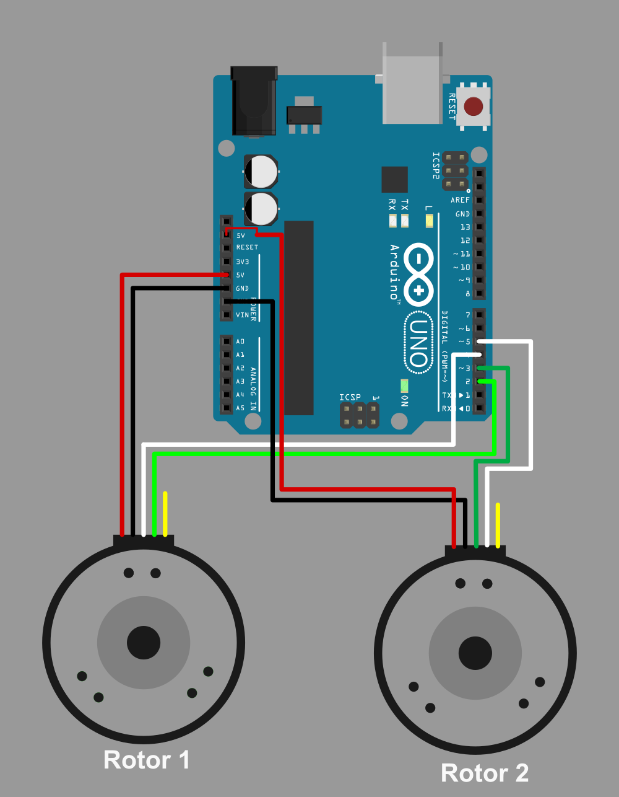

# Rotor Info
An Arduino collects data from two Rotary encoders (RP3806G-1000BZ-5-24-E) and sends their pulse count, rotation direction and timestamp to serial output.
This application reads that serial data, extracts pulse count and displays information about rotation of both rotors. Optionally it can log data in csv file.


**Serial output format:**

```html 
<timeStamp>|<state> <pulse>|<state> <pulse>\r\n
```

where
* `timestamp` and `pulse` are `long`
* `state` is `char` which is either `c` or `a`


# Build and run
## 1. Get source
```bash
git clone --depth 1 https://github.com/roopeshor/RotorInfo
cd RotorInfo
```
## 2. Build and run
### Dependencies
* Qt6 base
* Qt6 Serial port
### On windows
```bash
cmake -S . -B build -G "Visual Studio 17 2022"
cmake --build build --config Release
.\build\win\rotorinfo.exe
```

### On linux
```bash
cmake -S . -B build
make -C build -j12
./build/linux/rotorinfo
```

# Deploying

### windows
Add all required `dll` files to `build/win` directory with [windeployqt](https://doc.qt.io/qt-6/windows-deployment.html):
```bash
cd build/win
windeployqt --no-translations rotorinfo.exe
```

the `build/win` directory can be compressed and shared to other systems.

# Wiring


